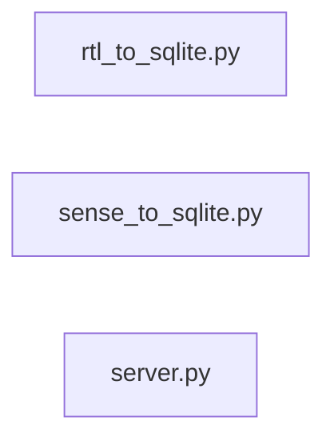

# Weather_Station

[](https://github.com/AnthoGit62/Weather_Station) [](https://github.com/AnthoGit62/Weather_Station/commits) 

## Sommaire

- [Installation](#installation)
- [Aperçu du code](#aperçu-du-code)

## Installation

```bash
git clone https://github.com/AnthoGit62/Weather_Station.git
cd Weather_Station
```

<!-- autodoc:start -->
## Aperçu du code

3 fichiers source (py), 300 lignes, 0 dépendances internes.

### Modules

| Fichier | Rôle | API publique |
| --- | --- | --- |
| `rtl_to_sqlite.py` | — | `init_db`, `insert_data`, `parse_json`, `main` |
| `sense_to_sqlite.py` | — | `init_db`, `insert_data`, `main` |
| `server.py` | — | `parse_datetime`, `fetch_data`, `get_local_ip`, `MyHandler` |

### Architecture



<!-- autodoc:end -->

---

_Documentation générée par autodoc-agent à partir du code source._
